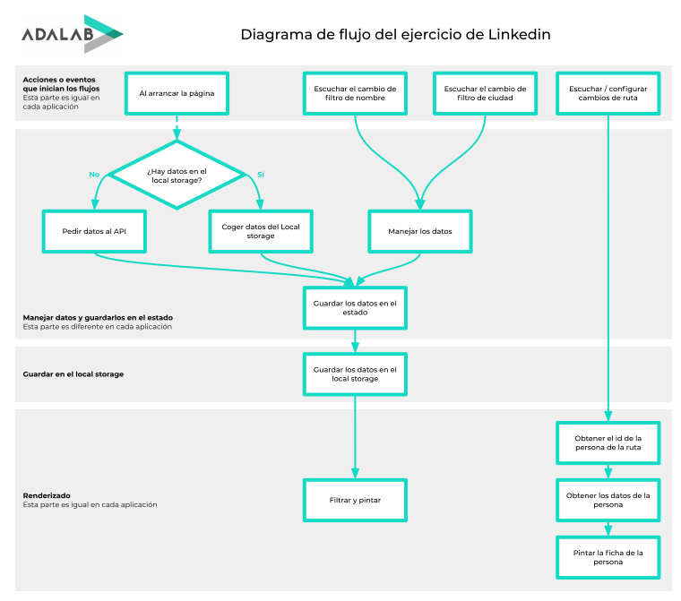

Módulo 3 - React

# LinkedIn

Ejercicio de repaso final.

**URL del ejercicio: [LinkedIn](https://mararochafernandez.github.io/react-linkedin/)**

- [x] Dibujar en papel y estructurar componentes
- [x] Obtener datos de la API y limpiarlos
- [x] Pintar el listado de usuarios
- [x] Escuchar los eventos de los filtros
- [x] Filtrar usuarios por nombre y género
- [x] Asignar una ruta a cada usuario
- [x] Filtrar usuarios por ciudad
- [x] Eliminar ciudades repetidas

[ejercicios-extra/react-linkedin](https://github.com/Adalab/ejercicios-extra/tree/master/react-linkedin)

---

---

_Happy coding!_
